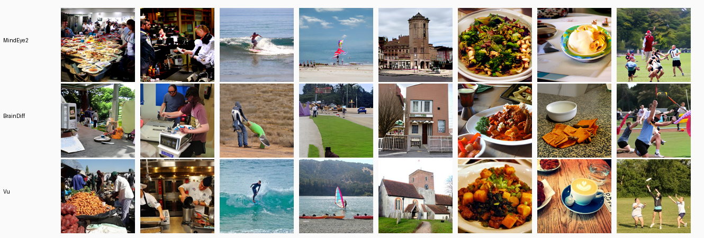
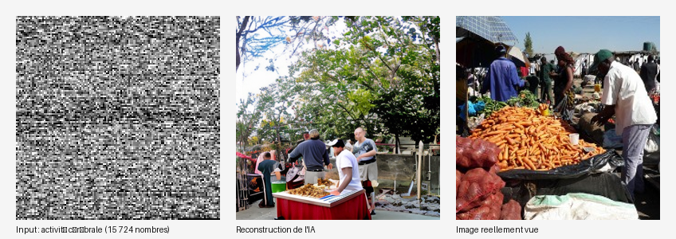

# NeuroGallery

Reconstruct the images someone looked at, using only their brain activity.

NeuroGallery takes fMRI scans of a person viewing photos and rebuilds those photos from the brain signal alone. No image ever goes into the model. It all runs on my own machine (no cloud, no API), and the results are packaged as a small web gallery you can click through.



*Top two rows are reconstructed from brain activity (MindEye2, then Brain-Diffuser). The bottom row is the photo the person was actually looking at.*

## What it is

A hands-on reproduction of the Brain-Diffuser and MindEye2 fMRI-to-image work, run on the Natural Scenes Dataset (NSD) and turned into something you can browse:

- 982 reconstructions for NSD subject `subj01`, on the shared-1000 test set.
- Two methods to compare: MindEye2 (current state of the art) and Brain-Diffuser.
- A look at what the model actually gets: real activity from the visual cortex, not a picture.



*This is the actual input. fMRI activity in the visual cortex, mapped back onto the brain.*

## How it works

Same idea whether you're seeing or (in principle) dreaming:

```
brain activity  →  regression  →  CLIP embedding (~768 numbers)  →  diffusion  →  image
```

Three steps:

1. Measure. An fMRI records blood oxygenation across roughly 15,700 voxels in the visual cortex while the person looks at an image.
2. Translate. A ridge regression turns that voxel pattern into a CLIP embedding, the same space images live in.
3. Generate. A diffusion model paints an image that fits the predicted embedding. It never sees the original photo.

The Method page in the app walks through this with an animated diagram and a real worked example.

## The app

A React + Vite + TypeScript static site (`app/`) with a dark, lab-ish look. Four pages:

- Gallery: all 982 reconstructions, filterable by method and category, sortable by how close they land to the original.
- Method: how the pipeline works, with a plain "what it does and what it doesn't" section.
- Dreams: the nearby question of reading dream content off sleep fMRI (there's a caveat further down).
- Identify: a little game where you guess which photo the person saw from the reconstruction.

It's keyboard-navigable, respects reduced-motion, and works in light and dark. More in [`app/README.md`](app/README.md).

## The lab

The Python side (`lab/neurogallery`) generates the artifact the app reads, offline and reproducibly. Details in [`lab/README.md`](lab/README.md).

- `reconstruct/`: ridge fitting, the CLIP embedder, the diffusion reconstructor.
- `build/`: packs reconstructions into a validated manifest.
- `licensing/`, `metrics/`, `dreams/`: reference-image license checks, fidelity metrics, the dream-decoding code.
- `scripts/`: `acquire_data`, `prepare_metadata`, `fit_ridge`, `run_build`, `add_mindeye2`, and friends.

It all runs locally on an RTX 5070 (PyTorch cu128) under WSL2.

## Layout

```
app/    the web gallery (React/Vite)
lab/    the Python pipeline that makes the reconstructions
docs/   design notes and plans
*.schema.json   data contracts shared by both sides
```

## Running it

The app needs no GPU; it ships with the demo data:

```bash
cd app
npm install
npm run dev      # http://localhost:5173
npm run build    # production build in app/dist
npm test
```

Regenerating the reconstructions needs the NSD data and a GPU. Full steps are in [`lab/README.md`](lab/README.md); roughly:

```bash
cd lab
uv sync
uv sync --extra gpu   # torch comes from the cu128 index, see lab/README.md
# then: acquire_data, prepare_metadata, fit_ridge, run_build   (or add_mindeye2 for the SOTA recons)
```

## Data and licensing

Worth reading before you make the repo public.

The repo only ships images I generated, plus a handful of reference photos that carry permissive licenses; the restrictive ones are hidden at build time. The NSD brain data and the full MS-COCO image set are not in here, they stay outside the repo.

The Natural Scenes Dataset has its own terms of use. If you publish or deploy this, first check that your use of anything NSD-derived is allowed. When in doubt, ship only the reconstructions and drop the reference photos.

## About the Dreams tab

I went out of my way not to oversell this one. The Dreams tab is about decoding dream content from sleep fMRI (Horikawa et al., Science 2013, the finding that the visual cortex fires in much the same way whether you're seeing something or dreaming it). The decoding code for real sleep data is written and tested (`lab/neurogallery/dreams/`).

The snag: the study's only public download (ATR's brainliner) went offline, and the data was never mirrored anywhere durable. So for now the tab shows a clearly labelled stand-in instead of real decoded dreams. Nothing in the app pretends a placeholder was actually decoded.

## Built with

Front end: React 18, Vite, TypeScript, Framer Motion, TanStack Virtual, Vitest, Playwright.
Pipeline: Python, PyTorch (cu128), diffusers, OpenCLIP, scikit-learn, nibabel, h5py, uv.

## Papers this builds on

- Allen et al. (2022). Natural Scenes Dataset. Nature Neuroscience.
- Ozcelik and VanRullen (2023). Brain-Diffuser.
- Scotti et al. (2024). MindEye2.
- Horikawa et al. (2013). Neural Decoding of Visual Imagery During Sleep. Science.

## License

The code is MIT. The data, brain recordings, and reference images are not; they keep their own terms (see Data and licensing above).

Personal project, built to learn and tinker. Not a medical or diagnostic tool.
